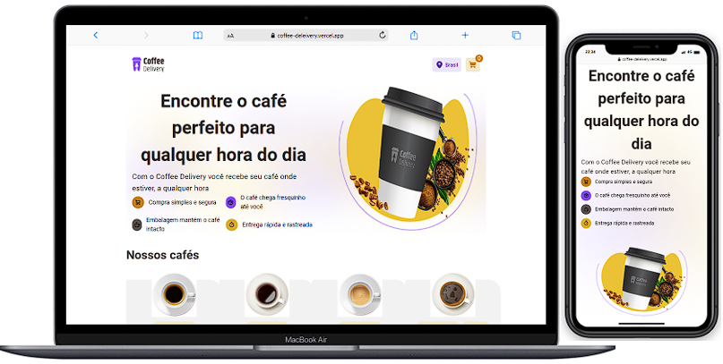

# Github Blog
Aplicação de uma cafeteria fictícia

## funcionalidades

- Listagem de produtos (cafés) disponíveis para comprar
- Adicionar uma quantidade específicas de itens no carrinho
- Aumentar ou remover a quantidade de itens no carrinho
- Formulário para o usuário preencher com validação
- Exibir o total de itens no carrinho no Header
- Exibir o valor total da soma de itens no carrinho multiplicados pelo valor

[](https://app.netlify.com/sites/wondrous-daffodil-b6a52a/deploys)

## Stack utilizada

**Front-end:** React | HTML | Tailwind | typescript | react-hook-form | react-router-dom 

**Layout:** Figma

[](https://www.figma.com/file/8p3G5LjGNEcMwD5htWzxDG/Coffee-Delivery-(Copy)?node-id=0%3A1&t=6GCD6bkDN99nLq5x-0)





## Instalação

Instale my-project com npm

```bash
# Clone este repositório
$ git clone <https://github.com/luiszkm/CoffeeDeleivery.git>

# Instale as dependências
$ npm install

# Execute a aplicação em modo de desenvolvimento
$ npm run dev

```
    
## Licença

[MIT](https://choosealicense.com/licenses/mit/)


## Apêndice

Feito com :heart: e dedicação por mim :rocket:

[](https://www.linkedin.com/in/luis-soares-64b0a6227/)


